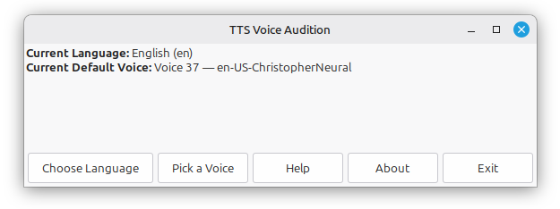
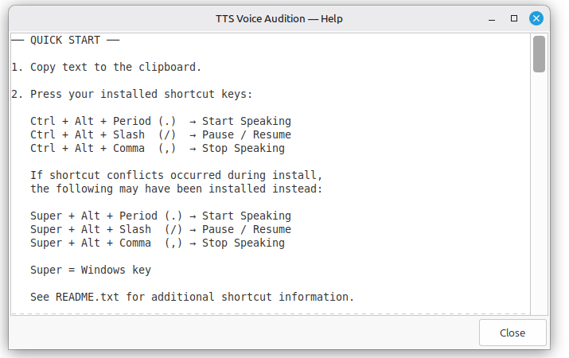
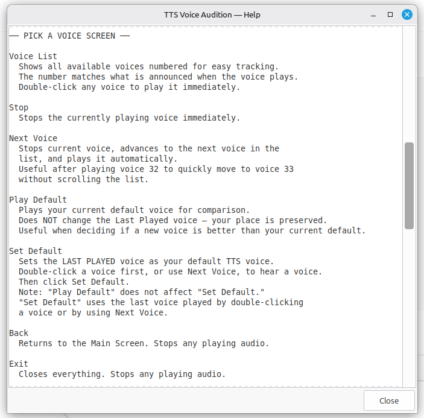
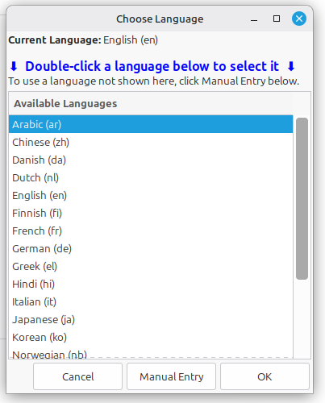
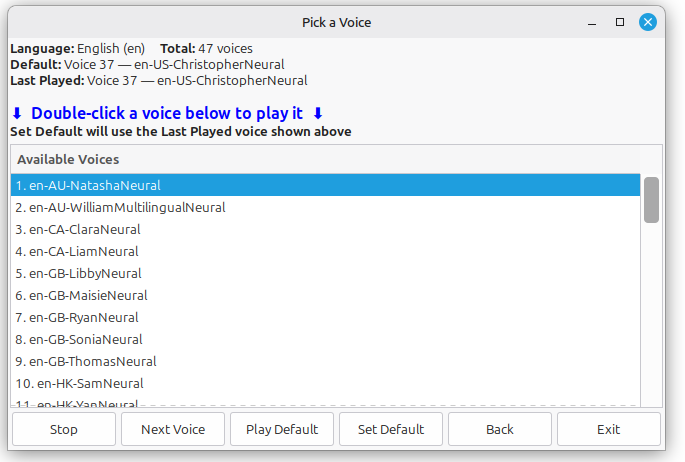
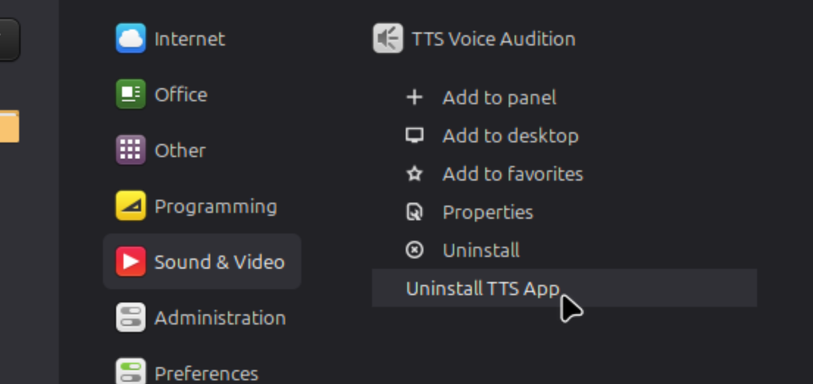

# Linux Mint TTS

Linux Mint TTS started as an attempt to solve a practical problem: getting reliable text-to-speech playback working smoothly with Scrivener on Linux Mint.

The project eventually evolved into a standalone clipboard-based TTS utility for Linux Mint Cinnamon with:

- keyboard shortcut support
- pause/resume/stop controls
- voice audition and language selection
- automatic shortcut conflict handling
- uninstall support
- X11 clipboard support with Wayland fallback support

The app now works independently of Scrivener and can be used with virtually any application that supports copy/paste.

Tested primarily on:

- Linux Mint Cinnamon 22.2
- Linux Mint Cinnamon 22.3

---

## Features

- Clipboard speech playback
- Keyboard shortcut support
- Pause / Resume / Stop controls
- Voice audition and language selection
- Configurable default voice
- Automatic keyboard shortcut conflict handling
- Safe uninstall support
- X11 clipboard support
- Wayland clipboard fallback support

---

## Screenshots

### Main Window



### Keyboard Shortcuts



### Help Window



### Select a Language



### Select a Voice



### UNINSTALL



---

## Installation

### Option 1 — Graphical method

1. Right-click `install.sh`
2. Choose: `Properties → Permissions`
3. Enable: `Allow executing file as program`
4. Close Properties
5. Double-click `install.sh`
6. Choose: `Run in Terminal`

If `install.sh` opens in a text editor instead of running, the file probably does not have Execute permission enabled yet.

---

### Option 2 — Terminal method

```bash
chmod +x /path/to/TTS-Linux-Mint/install.sh
bash /path/to/TTS-Linux-Mint/install.sh
```

Example if the package is in Downloads:

```bash
chmod +x ~/Downloads/TTS-Linux-Mint/install.sh
bash ~/Downloads/TTS-Linux-Mint/install.sh
```

---

## Quick Start

1. Copy text to the clipboard.

2. Press your installed shortcut keys:

```text
Ctrl + Alt + .   → Start Speaking
Ctrl + Alt + /   → Pause / Resume
Ctrl + Alt + ,   → Stop Speaking
```

If shortcut conflicts occurred during install, the following may have been installed instead:

```text
Super + Alt + .  → Start Speaking
Super + Alt + /  → Pause / Resume
Super + Alt + ,  → Stop Speaking
```

Super = Windows key.

See `README.txt` for additional shortcut information.

3. Use TTS Voice Audition to:

- choose language
- preview voices
- set your default voice

---

## Uninstall

### Menu method

Right-click:

```text
TTS Voice Audition → Uninstall TTS App
```

Do not use the generic Linux Mint “Uninstall” option if it appears.

### Terminal method

```bash
bash ~/Voices/uninstall.sh
```

---

## Clipboard Support

Linux Mint TTS supports:

- `xclip`
- `xsel`
- `wl-clipboard` / `wl-paste`

Wayland support depends on actually running a Wayland session.

If `wl-paste` cannot connect to a Wayland server, the tool falls back to `xclip` or `xsel`.

To check your current session type:

```bash
echo $XDG_SESSION_TYPE
echo $WAYLAND_DISPLAY
```

---

## Contact

gabrieljlawson@gmail.com
